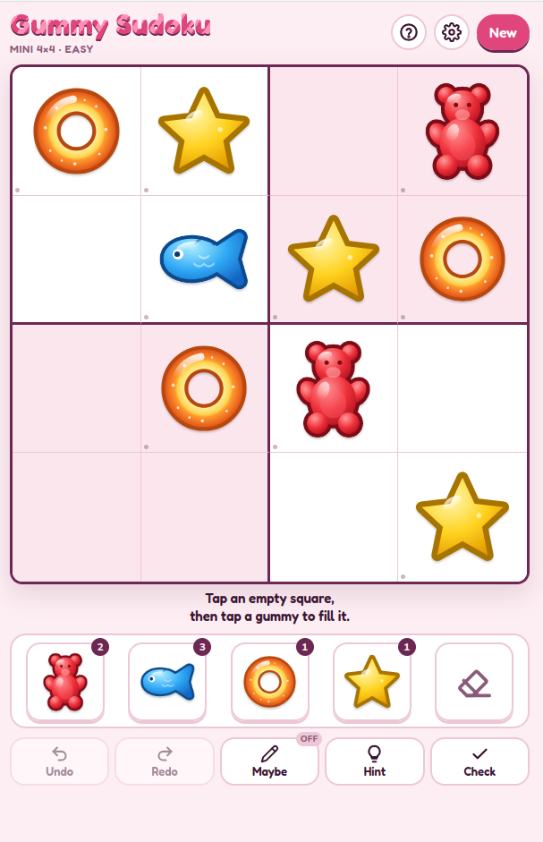

# Gummy Sudoku



**[Play it online](https://gummy-sudoku.coderonfire.workers.dev/)**

Sudoku with gummy sweets instead of numbers. Made for someone who finds number
sudoku confusing but loves colourful match-three mobile games.
A personal, non-commercial project.

## Playing

- Tap an empty square, then tap a gummy to fill it. Or pick a gummy first, then tap squares to drop it in.
- **Maybe** (pencil button) jots one small, outlined gummy in a square's top-right corner as a reminder. Tap another gummy to swap it. Placing a gummy clears the square's maybe and tidies the same gummy's maybes from its row, column and box.
- **Undo** and **Redo** cover gummies and maybes.
- A gummy in exactly the right place gets a little star burst and jelly wobble.
- **Hint** shows a ghost gummy and explains why it fits there. It never fills the square for you.
- Every row, column and thick-edged box needs one of each gummy.
- **Show where it fits** (off by default, turn on in settings) stripes the squares where the chosen gummy can't go.
- Three board sizes: Mini 4×4, Medium 6×6 and Big 9×9, each with Easy, Medium and Hard.
- Keyboard: arrow keys to move, 1–9 to place, Shift+1–9 or N (Maybe mode) for maybes, Backspace to clear, Ctrl+Z / Ctrl+Shift+Z to undo and redo.

Your game is saved in the browser, so you can close the tab and carry on later.

## Gummies

Each gummy has its own colour **and** its own shape, so they can be told apart
without relying on colour alone.

| #   | Gummy             | #   | Gummy              | #   | Gummy          |
| --- | ----------------- | --- | ------------------ | --- | -------------- |
| 1   | Red gummy bear    | 4   | Yellow gummy star  | 7   | Cola bottle    |
| 2   | Blue gummy fish   | 5   | Green gummy worm   | 8   | Pink raspberry |
| 3   | Orange peach ring | 6   | Purple gummy heart | 9   | Fried egg      |

The artwork is original SVG made for this project (`icons/gummies/`), in a soft,
glossy style: a radial-gradient body, a darker rounded rim and a white highlight.
It is released under the same MIT licence as the code.

To swap a gummy, replace its SVG in `icons/gummies/` (square `viewBox`, transparent
background) and update the `GUMMIES` list in `src/sudoku.js`.

## Files

- `index.html` – the page: markup and styles.
- `src/sudoku.js` – the game rules: puzzle generator, solver, hints, maybes and undo. Pure functions, no DOM.
- `src/app.js` – everything on screen: board, tray, buttons, sounds and saving.
- `manifest.webmanifest`, `sw.js` – make it an installable, offline-ready PWA
  when served over HTTPS.
- `scripts/build-site.js` – copies the served files into `dist/site` for Cloudflare.
- `wrangler.jsonc` – Cloudflare Workers config: serves `dist/site` as static assets.
- `scripts/build-artifact.js` – writes `dist/artifact.html`, the single-file version published
  as a Claude Artifact (drops the PWA-only tags marked `data-pwa` and inlines both modules).
- `tests/` – Vitest tests for the game rules and both builds.

## Development

Needs Node.js 22 or newer.

```sh
npm install
npm run check          # format check, lint and tests: run before every commit
npm test               # Vitest, once
npm run test:watch     # Vitest, re-running on save
npm run lint           # oxlint
npm run format         # oxfmt, rewrites files
npm run build          # dist/site, the files Cloudflare serves
npm run build:artifact # dist/artifact.html
```

The page uses ES modules, so it needs a web server rather than opening the file directly:

```sh
python3 -m http.server
# open http://localhost:8000
```

## Deploying

The site is hosted as a Cloudflare Worker with [static assets](https://developers.cloudflare.com/workers/static-assets/)
and no Worker script. [Workers Builds](https://developers.cloudflare.com/workers/ci-cd/builds/) deploys every
push to `main`. In the Worker's **Settings > Build**:

- **Build command:** `npm run check && npm run build`
- **Deploy command:** `npx wrangler deploy` (the default)

The Worker's name in the dashboard must match `name` in `wrangler.jsonc` (`gummy-sudoku`).
To deploy by hand instead, run `npm run deploy` (Wrangler asks you to log in the first time).

To preview the Cloudflare build locally: `npm run build && npx wrangler dev`.

Tooling: [oxlint](https://oxc.rs/docs/guide/usage/linter) (`.oxlintrc.json`: correctness errors,
suspicious and performance warnings, plus the unicorn, import, promise and vitest plugins),
[oxfmt](https://oxc.rs/docs/guide/usage/formatter) (`.oxfmtrc.json`: single quotes, 100
columns) and [Vitest](https://vitest.dev/).
